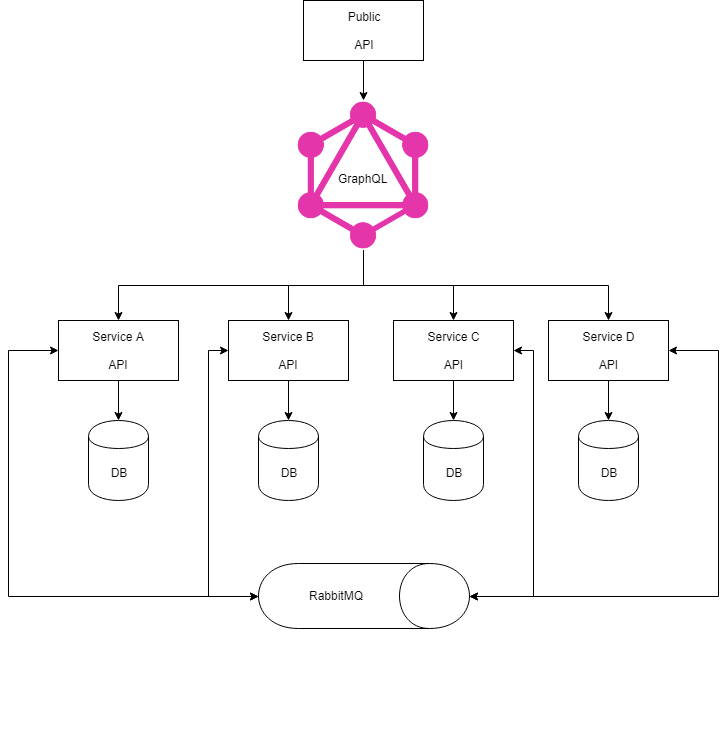

# NetCoreMicroservicesSample
Example implementing an API with microservices using CQRS pattern, event sourcing, message brokers, etc.

[I've written a short Medium post about this repository](https://medium.com/@madslundt/microservices-with-event-sourcing-using-net-core-33e3074171f5)

Keep in mind this repository is work in progress.

## Requirements
 - **Consul**: Service discovery
 - **Elasticsearch**: Storing logs, metrics, etc.
 - **EntityFramework**: Database ORM
 - **FluentValidator**: Validate requests
 - **Kibana**: Visualizing logs, metrics, etc.
 - **MediatR**: CQRS
 - **Mongo**: MongoDB driver
 - **RabbitMQ**: Event bus (publish/subscribe)
 - **Serilog**: Logging provider
 - **SQL server**: MSSQL database


## Run with Docker
This can be run with `docker-compose`.
Simply go to the [Compose](/Compose) folder and run `docker-compose up --build`.

## Architecture


The architecture shows that there is one public API (API gateway). This is accessible for the clients. This is done via HTTP request/response.

The API gateway then routes the HTTP request to the correct microservice.
The HTTP request is received by the microservice that hosts its own REST API. Each microservice is running within its own domain and has directly access to its own dependencies such as databases, stores, etc. All these dependencies are only accessible for the microservice and not to the outside world. In fact microservices are decoupled from each other. This also means that the microservice does not rely on other parts in the system and can run independently of other services.

Microservices are event based which means they can publish and/or subscribe to any events occurring in the setup. By using this approach for communicating between services, each microservice does not need to know about the other services or handle errors occurred in other microservices.

Event sourcing can be used to store events that have been published from the service performantly. By using the event sourcing approach the database will become the read model of the service. The only write operations done in the read model are when subscribed events need to update or insert data to the database.

Outbox can be used as a landing zone for events before they are published to the message broker. Events in the Outbox database are published to the message broker via a background service. If the connection to the message broker is broken, the background service will try until the event has been published successfully. After the event has been published successfully to the message broker, the event in the Outbox database is either removed or kept with a flag that it has been published successfully.

The Outbox database and the event store have essentially the same data format. The major difference is that the event sourcing is meant to be a permanent and immutable store of domain events, while the Outbox database is meant to be highly ephemeral and only be a landing zone for domain events to be captured inside change events and forwarded to downstream consumers.

All of this is optional in the application and it is possible to only use what that the service needs. Eg. if the service does not want event sourcing via an event store but rather have a read/write database (like in the *UsersService*).

<br />

In this example **UsersService** is not storing events in an event store. The service are publishing and subscribing to events in order for other services to take action when necessary.
<br />
**MoviesService** and **ReviewsService** are storing events in an event store, and are fully implementing CQRS with ES.

## Structure
How this repository is structured:

- **ApiGateway**: Api gateway.
- **Compose**: Docker compose to set up all dependencies (eg. RabbitMQ, SQL Server, etc.)
- **Src/\*Service**: Microservices in their own solution.
- **Src/Events**: All events that are published and subscribed to.
- **Infrastructure**: Infrastructure for microservices (eg. setup RabbitMQ, Consul, Logging, etc.)

### Api
Api gateway is using Ocelot to have a unified point of entry to all microservices.
Configuration for this can be found in the subfolder Configuration.

### Microservice
Microservices are REST APIs and are created without any knowledge to each other. If a microservice wants to notify other services it simply publishes an event and the services subscribing to this event can take action on it using publish/subscribe with RabbitMQ.

A microservice consists of:
 - **Controllers**: API endpoints for the microservice.
 - **Queries**: Queries used to get data when client wants to read data.
 - **Commands**: Commands used to write data when client wants to modify data.
 - **EventHandlers**: Handlers for events to take action when events are being published.
 - **Repository**: Repository used with event sourcing when modifying data in the application. This will also publish the correct events.

Next to the microservice is the data model. This contain the migrations, models and update handlers (if using event sourcing) for the database.
<br />
Update handlers in the data model are listening to an event, just like the event handlers. The only job for the update handlers is to update the read model in order for the events to populate to the read model.


### Infrastructure
Infrastructure contains the logic for the different services and keeps most of the boiler code hidden from the services.

- [Consul](#Consul)
- [Core](#Core)
- [EventStore](#EventStore)
- [Logging](#Logging)
- [MessageBrokers](#MessageBrokers)
- [Outbox](#Outbox)
- [Swagger](#Swagger)

#### Consul
Consul is used as service discovery. This is used by the services and the API gateway in order to call other services by name/id, rather than by uri.

Appsettings for consul looks like this
```
{
    "consulOptions": {
        "Id": "",
        "Name": "",
        "Tags": [],
        "Address": ""
    }
}
```

- **Id** is optional and is by default a random UUIDv4 appended with the port from the address.
- **Name** is optional and is by default the name of the application domain.
- **Tags**: is optional and is by default empty.
- **Address** is required and must include uri schema, host and port (eg. http://localhost:8500).

`AddConsul` and `UseConsul` is used in order to include it in the application.


#### Core
Core contain basic functionalities and must be imported most of the other services to work well. Core functionalities are:

- **Commands** contain a mediator wrapper for command, command handler and command bus.
- **Events** contain a mediator wrapper for event, event handler and event bus.
- **Queries** contain a mediator wrapper for query, query handler and query bus.
- **ExceptionFilter** contain logging exceptions, add error message to http response, and translating exceptions to http status codes.
- **Mapping** contain functionality to map one object into a class.
- **ValidationBehavior** contain validation and is added as a mediator pipeline. This makes sure to run validation if such is added to the request.

`AddCore` is used with a type from each project that needs to include CQRS.

#### EventStore
Event store is a database where all events published in the application are stored. This is used with event sourcing and will be a write model for the application.

At the moment the event stores supported are *MongoDb* and *EF core*.

`AddEventStore` is used with the aggregate as the type, and the Configuration and DbContextOptionsBuilder (only used with EF core) to include event store in the application.

Choice of event store is configured in appsettings with the key **EventStoreType**.

Besides that it also contain interfaces and abstract classes:
- **Aggregates** is a set of related entities and value objects that model a single thing (or related set of things) which need to remain internally consistent.
- **Repository** is the repository for the aggregates. This makes sure to store the event to the event store and publish the event to the message broker (if Outbox is added to the service it will use Outbox).

- **Core**: Contain core functionalities and must be imported for other services to work well. This contain aggregate, command, query, and event type, global exception filter.

##### MongoDb
```
{
    "EventStoreOptions": {
        "EventStoreType": "mongo",
        "DatabaseName": "",
        "CollectionName": "",
        "ConnectionString": ""
    }
}
```

- **DatabaseName** is optional and is by default 'EventStore'
- **CollectionName** is optional and is by default 'Events'.
- **ConnectionString**: is required and must include uri schema, host and port (eg. mongodb://localhost:27017)

##### Ef core
```
{
    "EventStoreOptions": {
        "EventStoreType": "ef"
    }
}
```
Choice of database is set when using *AddEventStore* with **DbContextOptionsBuilder**.

#### Logging
Logging is using Serilog and ELK APM.

`LoggingExtensions.AddLogging` and `UseLogging` is used to include logging in the application.
<br />
`UseSerilog` must be used in *Program.cs*.

#### MessageBrokers
Message broker is used to publish and subscribe to events across services. This is to allow services send events to each other.

At the moment the only message brokers supported is *RabbitMQ*

`AddMessageBroker` is used to include message broker.

Choice of message broker is configured in appsettings with the key **MessageBrokerType**.

`UseSubscribeEvent` is used to subscribe to a specific event.
<br />
`UseSubscribeAllEvents` is used to subscribe to all events in the application.

##### RabbitMQ
```
"MessageBrokersOptions": {
    "messageBrokerType": "rabbitmq",
    "username": "",
    "password": "",
    "virtualHost": "",
    "port": 5672,
    "hostnames": [""],
    "requestTimeout": "",
    "publishConfirmTimeout": "",
    "recoveryInterval": "",
    "persistentDeliveryMode": true,
    "autoCloseConnection": true,
    "automaticRecovery": true,
    "topologyRecovery": true,
    "exchange": {
        "durable": true,
        "autoDelete": false,
        "type": "",
        "name": ""
    },
    "queue": {
        "declare": true,
        "durable": true,
        "exclusive": false,
        "autoDelete": false
    }
}
```

#### Outbox
Outbox is used to store events before they are published to the message broker. The events are either removed after being published to the message broker or kept with the *processed* property set to the datetime, in UTC, it was published to the message broker.

This sounds very familiar with the event store but Outbox is primarily to avoid connection problems with the message broker (slow connection, bad connection, etc.).
That also means that the Outbox database should be hosted very close to the service.

In order to publish events to the message broker a hosted service is running in Outbox to look for unpublished events in the interval of every 2 second.

`AddOutbox` is used to include Outbox in the application.

Choice of store is configured in appsettings with the key **OutboxType**.

##### MongoDb
```
"OutboxOptions": {
    "OutboxType": "mongo",
    "DatabaseName": "",
    "CollectionName": "",
    "ConnectionString": "",
    "DeleteAfter": true
}
```

- **DatabaseName** is optional and is by default 'EventStore'
- **CollectionName** is optional and is by default 'Events'.
- **ConnectionString**: is required and must include uri schema, host and port (eg. mongodb://localhost:27017)

##### Ef core
```
{
    "OutboxOptions": {
        "OutboxType": "ef",
        "DeleteAfter": true
    }
}
```
Choice of database is set when using *AddOutbox* with **DbContextOptionsBuilder**.

#### Swagger
Swagger is used for API documentation.

`AddSwagger` and `UseSwagger` is used to include swagger in the application.

